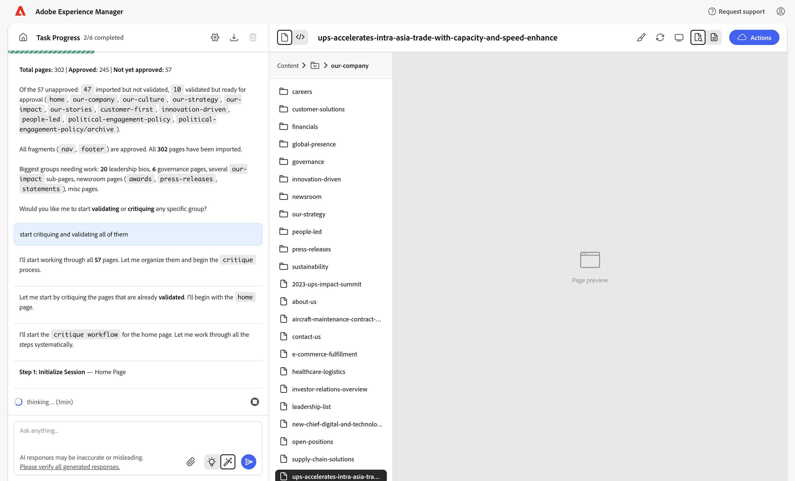
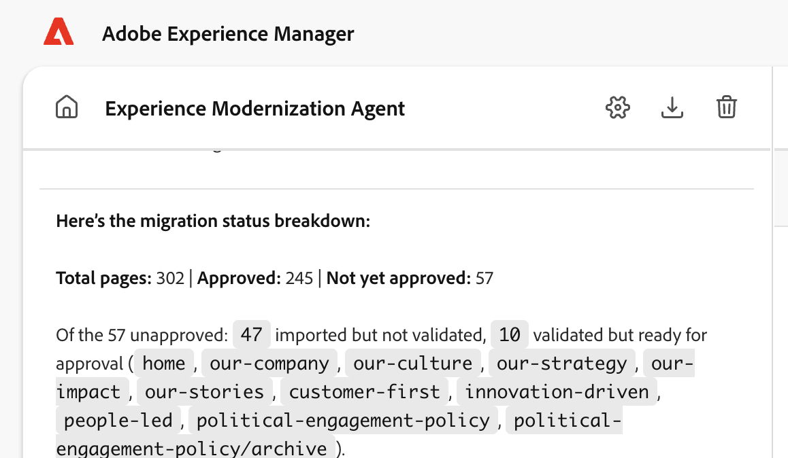
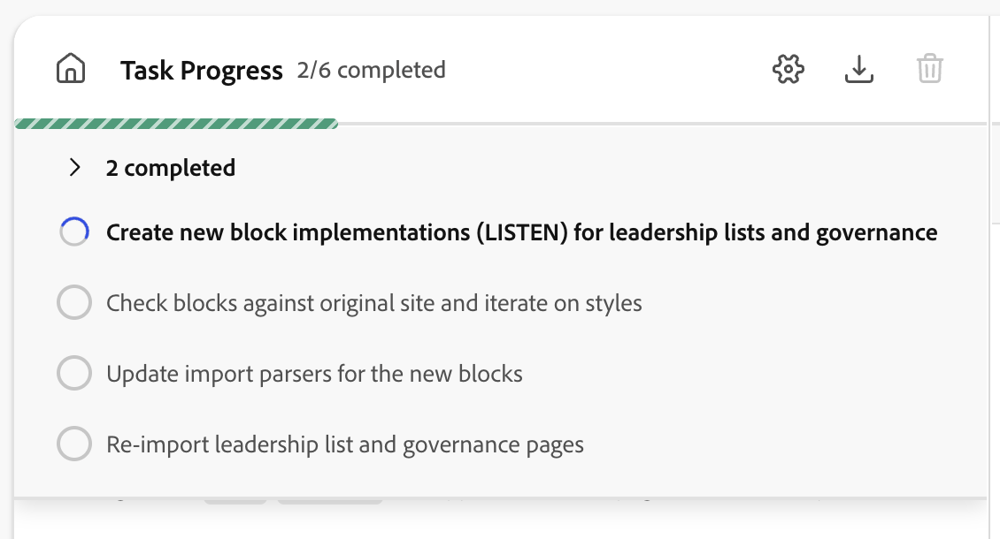
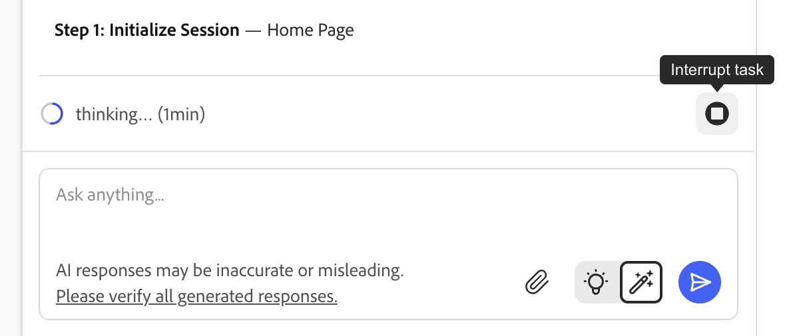
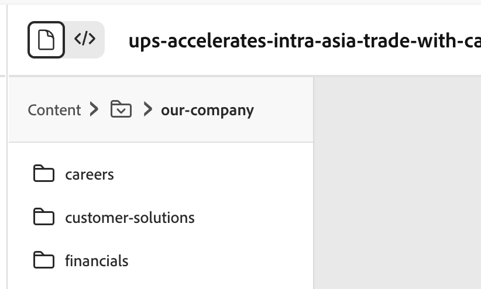
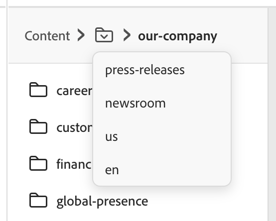
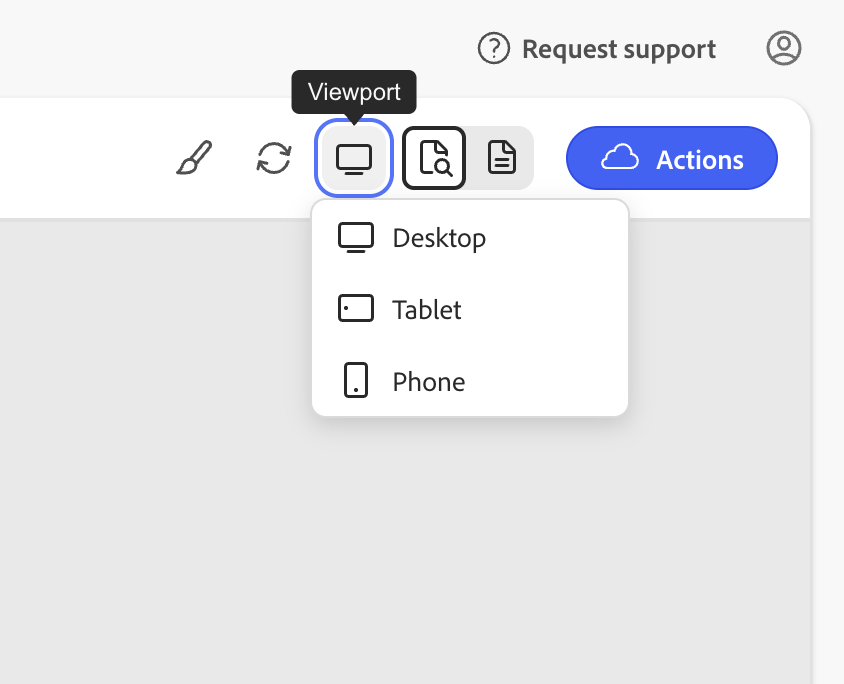
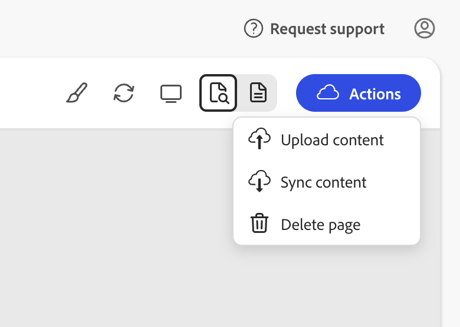
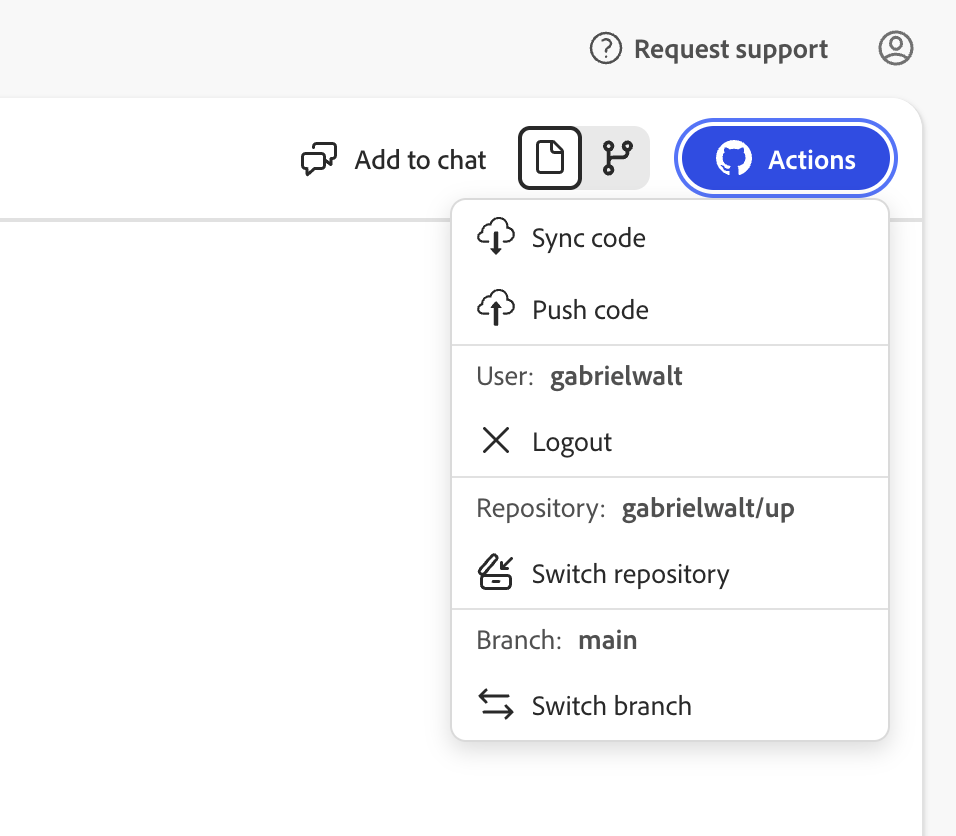

# ExMod UI Mock — Changes from Current UI

This document lists the main changes introduced in the UI mock compared to the current Experience Modernization Agent interface, and explains the rationale behind each. The mock is intended to kick off a conversation about how the interface should evolve—not a call for immediate implementation.

**Try the mock:** https://gabrielwalt.github.io/mock/

---

## Motivation

The current UI has become increasingly confusing as features are added and iterated. There are too many different toolbars, alignment issues, and screen real estate usage is poor—which is challenging even on large screens when displaying the original site next to ExMod for comparison.

---

## 1. Global layout — Single toolbar split into two parts

**Change:** The mock uses a single toolbar concept split into two parts: one above the chat panel and one above the content view.

**Why:** To reduce toolbar proliferation and improve alignment. The screen is deliberately crowded in the mock to show a realistic situation with many things going on, as it usually is when using the console.

**Note:** The panels can be resized when trying out the HTML version of the mock.

---

## 2. Chat toolbar and message styling

**Change:** Above the chat, a simple toolbar with home, settings, download, and clear chat. Agent messages are not wrapped in bubbles; only user messages get a blue bubble.

**Why:** To avoid visual overload and make it easier to spot user messages when scrolling through long conversations.

---

## 3. Task progress

**Change:** When a task is in progress, the toolbar title switches from "Experience Modernization Agent" to "Tasks Progress" (with the count, e.g. 2/6 completed). Clicking it toggles the task list unfolded below it.

**Why:** To surface progress without taking permanent space, and to keep the task list accessible on demand.

---

## 4. Compact prompt and interrupt

**Change:** The prompt at the bottom is much more compact. You can interrupt the task right next to the "thinking…" indicator. The stop button no longer replaces the submit button when the agent is running.

**Why:** To save vertical space and to allow sending multiple messages while the agent is running—messages are queued to the agent, so the submit button remains usable during a task.

---

## 5. Single view switcher — content, document, code, and changes

**Change:** A single dropdown at the left of the content toolbar switches between content preview, document view, code files, and changes. Previously, there were two buttons in a vertical toolbar at the far left of the screen and a separate switcher in a horizontal toolbar at the far right of the screen.

**Why:** To consolidate view switching into one control, place it next to the panel it affects, and eliminate the split between left and right edges of the screen.

---

## 6. Breadcrumb order and root label

**Change:** The breadcrumb order is inverted: deepest folder at the top, root at the bottom. The root folder is renamed from "Workspace" to "Content".

**Why:** To align the hierarchy with how users typically navigate (drilling down from root), and to clarify the root label.

---

## 7. Preview options and viewport

**Change:** Preview options are merged into the content toolbar. The Picker, Refresh, and Viewport icons only appear when the switcher is on "Preview"; they disappear when switching to "Document View". Viewport options (Desktop, Tablet, Phone) are grouped in a dropdown.

**Why:** To reduce clutter and show only relevant controls for the current mode.

---

## 8. Document actions menu

**Change:** Instead of "Upload Content", a more generic Actions menu. Besides push, an explicit "Sync" option to pull content. The menu also includes Delete.

**Why:** To support bidirectional content flow (sync/pull will be needed going forward) and to consolidate document operations in one place.

---

## 9. Code view and GitHub actions

**Change:** A GitHub Actions menu when switching to code view. GitHub info (user, repo, branch) is merged into the same menu. The "Add to chat" button is moved into the top menu.

**Why:** To consolidate GitHub-related controls and reduce toolbar sprawl.
